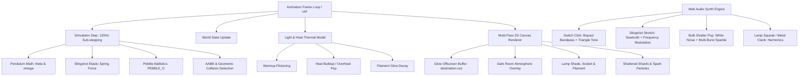

# 💡 Slingshot Lamp Interactive Experience: Technical Deep Dive & Integration Blueprint

> **Reference Source**: [kamran.fyi/lamp](https://kamran.fyi/lamp) by Kamran Ahmed (creator of roadmap.sh)  
> **Type**: Physics-driven 2D Interactive Canvas Toy & Procedural Audio Experience

---

## 1. Executive Summary & What It Is

The **Slingshot Lamp** is an award-winning, ultra-satisfying micro-game and interactive design experiment. It combines:
1. **A physical swinging ceiling lamp** that acts like a pendulum with realistic angular dampening and momentum transfer.
2. **Dynamic Volumetric Lighting & Shadows** rendered with multi-pass offscreen canvas blending.
3. **An interactive slingshot** at the bottom with pull back tension, trajectory prediction, elastic snap-back, and ballistic pebble projectile physics.
4. **Destructible Light Bulb & Shatter Physics**: When hit with sufficient velocity, the bulb shatters into 38+ physical glass shards and 40+ glowing fire sparks with particle bouncing and gravity.
5. **A 3D Skeuomorphic Wall Switch** that can be flipped by clicking or shot with a slingshot pebble to turn the room light ON/OFF.
6. **100% Zero-Asset Procedural Web Audio Synth**: All audio effects (squeaks, rubber stretch, switch clicks, metal clanks, pebble taps, and bulb explosions) are synthesized in real-time using the native browser `AudioContext` — **zero MP3/WAV audio files are needed**.

---

## 2. Technical Stack & Dependencies Analysis

### Are external packages or libraries needed?
**No external heavy dependencies are required.**

| Layer | Traditional Approach (Heavy) | kamran.fyi Implementation (Lightweight & Clean) |
| :--- | :--- | :--- |
| **Physics Engine** | Matter.js (~80KB) or Box2D (~200KB) | **Custom Pure Math** (~120 LOC) for pendulum + ballistics |
| **3D / Canvas** | Three.js (~600KB) or Pixi.js (~400KB) | **Native HTML5 Canvas 2D Context** (Zero bundle overhead) |
| **Sound Effects** | Howler.js + 10 MP3 files (~2MB) | **Native Web Audio API** (Oscillators + Noise Buffer + Biquad Filters) |
| **Framework** | Plain HTML/JS | **Seamless Next.js / React 19 Client Component (`"use client"`)** |

---

## 3. Core Architectural Modules

### Module Breakdown:
1. **Pendulum Simulation**:
   - Equations of motion: `acc = -(G / lamp.len) * sin(theta) - omega * damping`
   - Pointer dragging allows the user to grab the lampshade directly and swing it.
2. **Volumetric Lighting**:
   - Uses an offscreen canvas `glow` scaled at 25% resolution (`LIGHT_SCALE = 0.25`) with `ctx.filter = 'blur(5px)'`.
   - Conical beam projected from the lamp socket (`apex`) through the shade rims (`rl`, `rr`) into deep radial gradients.
   - Darkness layer inverted with `dctx.globalCompositeOperation = 'destination-out'` to cut a real light hole through the dark room.
3. **Skeuomorphic Wall Switch**:
   - Styled with CSS 3D perspective (`perspective: 120px`, `rotateX`).
   - Knocks physically when hit by pebbles using CSS variables `--kx`, `--ky`, `--kr` and dynamic keyframes.
4. **Synthesizer Engine**:
   - Procedural white noise buffer generated once upon user interaction.
   - Parameterized filters produce crisp clicks, stretching rubber sounds, metallic clanks, and glass shatter pops without latency.

---

## 4. Team Lead Recommendations: Where to Place It in Portfolio

Here are the 3 best strategic options to incorporate this into Nuhamin's portfolio:

### 🏆 Option 1: The "Midnight Lab / Interactive Playground" Section (Recommended)
- **Placement**: Directly between **Certifications / Skills** and the **ContactCTA / Footer**.
- **Concept**: Present it as an interactive engineering showcase titled `"THE MIDNIGHT LAB" / "PHYSICS & CREATIVE CODE EXPERIMENT"`.
- **Why it wins**:
  - Highlights strong full-stack / creative development chops (canvas mathematics, Web Audio API, real-time physics).
  - Doesn't interfere with recruiters quickly scanning resume / experience data.
  - Gives visitors a memorable, fun "wow factor" right before they reach the contact form.

### Option 2: Integrated into ContactCTA / Footer Header
- **Placement**: Directly embedded into the background of `ContactCTA` or `Footer`.
- **Concept**: Flipping the lamp illuminates the contact details or "turns off the office lights".
- **Why it works**: Creates high engagement at the bottom of the page.
- **Consideration**: Need to ensure it doesn't distract from the contact form input fields on mobile.

### Option 3: Dedicated `/experiments` or `/lamp` Route + Easter Egg Switch in Navbar
- **Placement**: Accessible via a floating "Lamp 💡" button in the Navbar or a dedicated route `/playground/lamp`.
- **Concept**: A full-screen dedicated sandbox just like Kamran's original site.

---

## 5. Implementation Roadmap for Next.js

1. **Create `components/SlingshotLamp/`**:
   - `SlingshotLamp.tsx`: React wrapper with `useRef<HTMLCanvasElement>` and pointer events.
   - `useLampPhysics.ts`: Physics loop, collision detection, and particle update logic.
   - `useLampAudio.ts`: Pure Web Audio procedural sound synthesizer.
   - `WallSwitch.tsx`: Skeuomorphic 3D CSS switch with impact knock response.
2. **Responsive & Mobile Optimization**:
   - Dynamic DPR clamping (`Math.min(window.devicePixelRatio, 2)`).
   - Touch event handling (`touch-action: none` on canvas).
   - Auto-scaling of slingshot anchor and lamp pendulum length based on container dimensions.
3. **Theme & Portfolio Harmony**:
   - Harmonize colors with portfolio's rich dark amber/espresso palette (`#140d08`, `#d97706`, `#faf6f0`).
